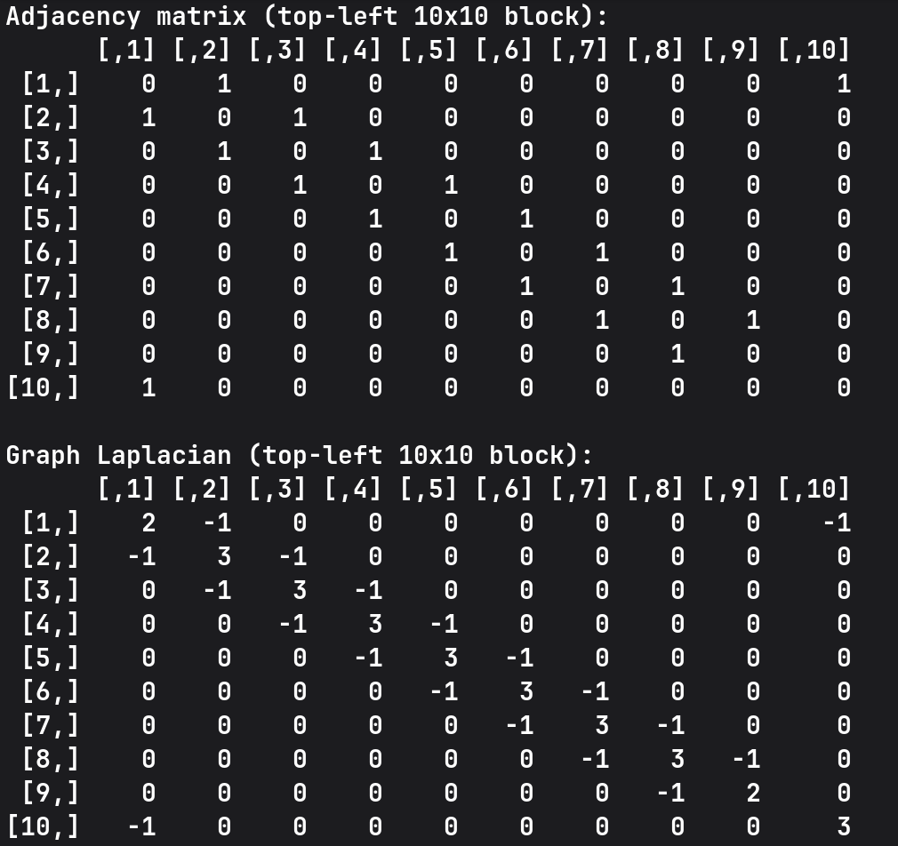
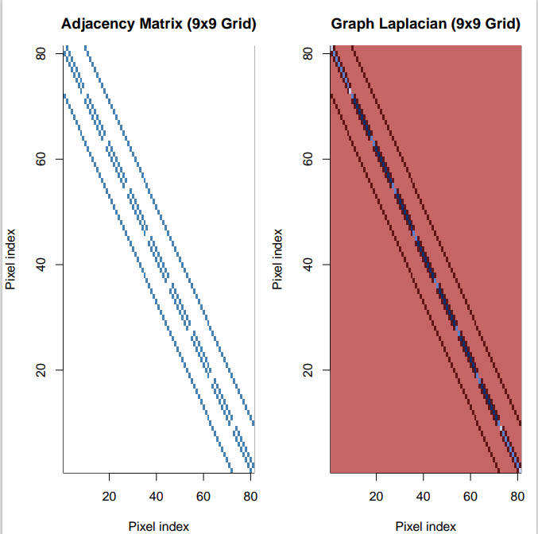

# hyperSpec Spatial Laplacian - Easy Task

This repository contains my submission for the **hyperSpec Easy Task**. The goal was to implement a 2D spatial adjacency matrix and derive the Graph Laplacian for a grid of spectral data.

## Task Objective
Construct a spatial relationship map for pixels in a hyperspectral dataset and calculate the "Spatial Roughness" using the Graph Laplacian formula: $L = D - A$.

## Implementation Details
- **Data Source:** `laser` dataset from the `hyperSpec` R package.
- **Grid Setup:** - Dynamic detection of available spectra (84 total).
  - Optimized for a **9x9 grid** (81 pixels) to maintain a perfect square for spatial analysis.
- **Sparse Efficiency:** Used the `dgCMatrix` class from the `Matrix` package. This ensures the implementation is memory-efficient, storing only the necessary neighbor connections rather than thousands of zeros.

## Key Results
- **Zero-Sum Validation:** Verified that $\sum rows(L) = 0$, confirming a mathematically balanced Laplacian.
- **Spatial Roughness Score:** Calculated a roughness value of **67988.27** for the primary wavelength.
- **Visual Proof:** The generated Adjacency Matrix and Laplacian show the expected "banded" structure of a 2D grid.




## Files
- `easy_task.R`: The complete R script containing logic for grid construction and math.
- `image.png`: Visual visualization of the Adjacency and Laplacian matrices.

## How to Reproduce
1. Clone this repository.
2. Ensure R is installed along with `hyperSpec` and `Matrix`.
3. Run the script:
   ```bash
   Rscript easy_task.R
   ````